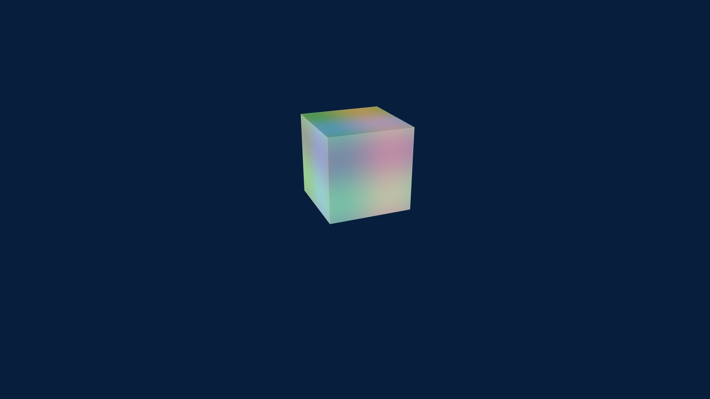
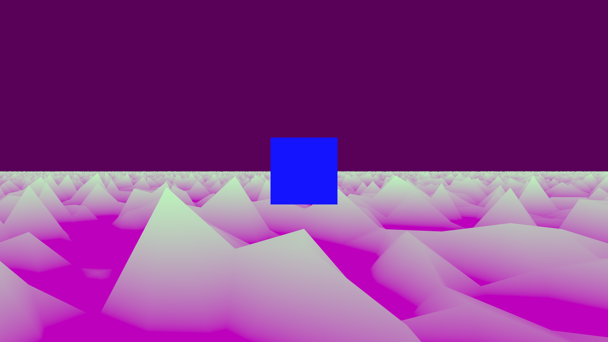

# Bevy Examples

This repo is a selection of contained examples using the Bevy game engine, often using the Material shader APIs in Bevy 0.8.

There is a branch tracking Bevy 0.9 for some examples

