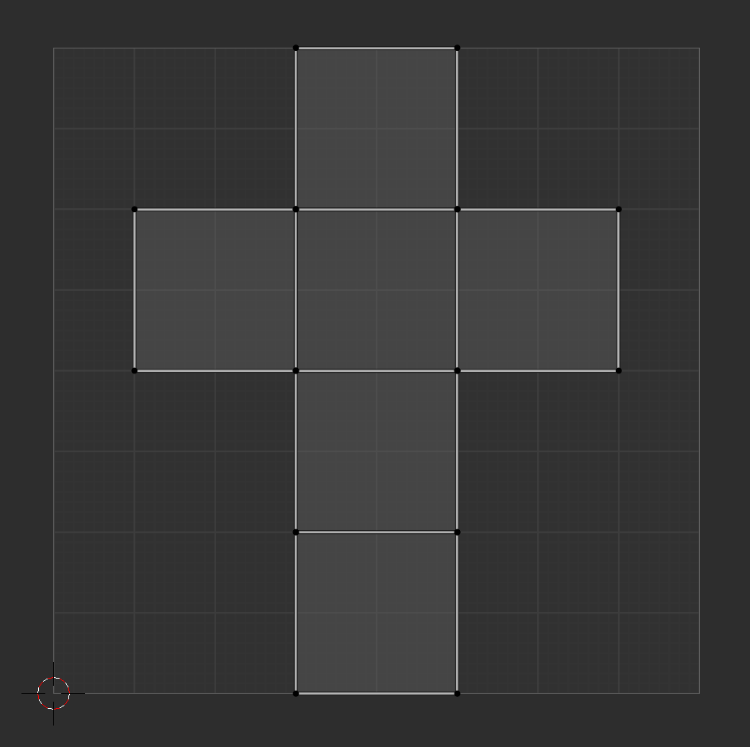
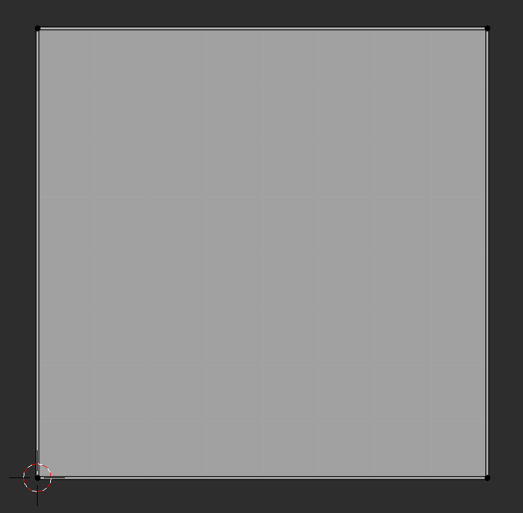
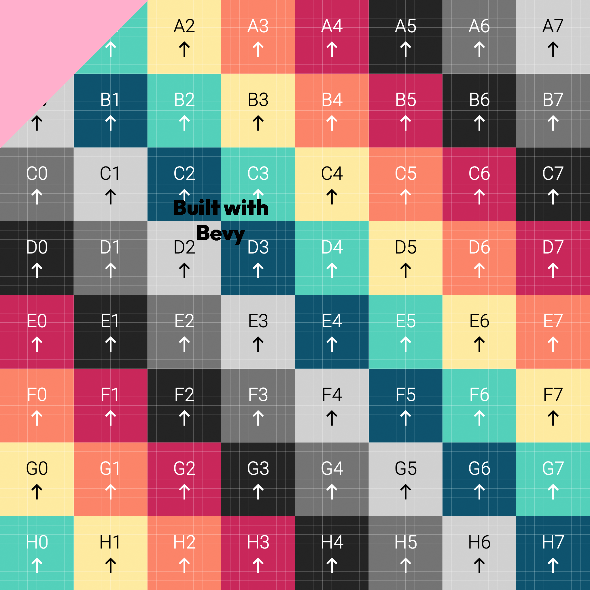

Bevy supports using two UV attributes. You might call them "a" and "b" or "primary" and "alternate".

The first UV is typically the "regular" UVs. For a default cube:

In blender the UV layout looks like this, with the sides of the cube in a vertical line and the top/bottom on the side of that line.

While in Bevy, the default cube UV layout places all four corners of every cube face full-sized and overlapping.

Having two sets of UVs is useful because you can use say, sample different textures using different UVs. For example, a trim sheet could use the Blender layout UVs, while a set of decals can be applied using the second set of UVs.

This example uses two uvs to show two applications. First the base color and the main uvs are shown on two cubes. This is the "base" state. Regular Bevy default UVs and a StandardMaterial texture that is being sampled.

The second state uses the second set of UVs, which are half the size on each axis compared to the primary. This uses the second set of UVs to sample the _same_ StandardMaterial base texture, but notice that the second set of UVs samples the smaller area resulting in showing 4 squares of the uvchecker, where the original is 8 squares.

The second cube is applying decals from a second texture on top of the base texture. The base texture is sampled using the main UVs, and the decals are sampled using the secondary UVs.

In effect, this is the way we're overlaying the decals on top of the uvchecker using two textures and two uv sets.

